# COROLA Rent A Car

**COROLA Rent A Car** is a full-stack car rental management platform built with **ASP.NET Core MVC**, **Entity Framework Core**, **MSSQL Server**, and a layered architecture.

The project includes a modern public website and a protected admin panel. Customers can browse cars, filter vehicles, create reservation requests, track reservation status, and send contact messages. Admin users can manage reservations, generate reports, send approval emails, use AI tools, and manage customer messages from the admin panel.

This project is designed as a real-world portfolio project, not just a basic CRUD application.

---

## Technologies

* ASP.NET Core MVC
* Entity Framework Core
* MSSQL Server
* N-Tier Architecture
* Repository Pattern
* FluentValidation
* AutoMapper
* MailKit
* QuestPDF
* Cookie Authentication
* OpenAI-ready AI Tools
* Razor Views
* Bootstrap
* JavaScript
* HTML / CSS

---

## Project Architecture

```text
COROLA_RENTACAR
│
├── COROLA_RENTACAR.EntityLayer
│   └── Entities and enums
│
├── COROLA_RENTACAR.DataAccessLayer
│   └── EF Core context, repositories and data access interfaces
│
├── COROLA_RENTACAR.BusinessLayer
│   └── Business services, managers and validation rules
│
├── CorolaDtoLayer
│   └── DTO models
│
└── COROLA_RENTACAR.WebUI
    └── MVC controllers, views, admin area and UI services
```

---

# Public Website

## Home Page

The home page introduces the rental platform with a vehicle slider, quick information cards, featured cars and customer-focused rental sections.

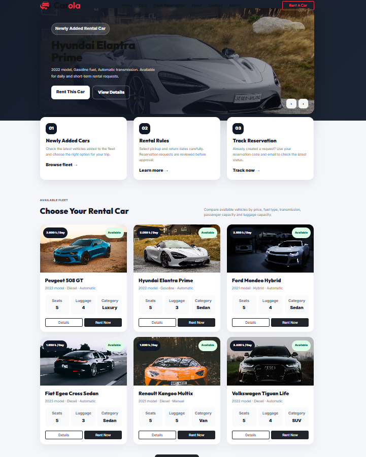

---

## Advanced Car Listing

Customers can search and filter vehicles by brand, category, fuel type, transmission, price range, seat count, luggage capacity and date availability.

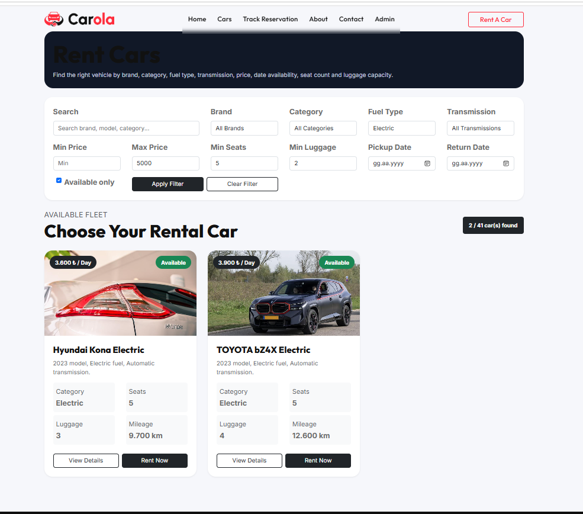

---

## Car Detail & Gallery

Each car has a detail page with specifications, daily price, main image and gallery images.

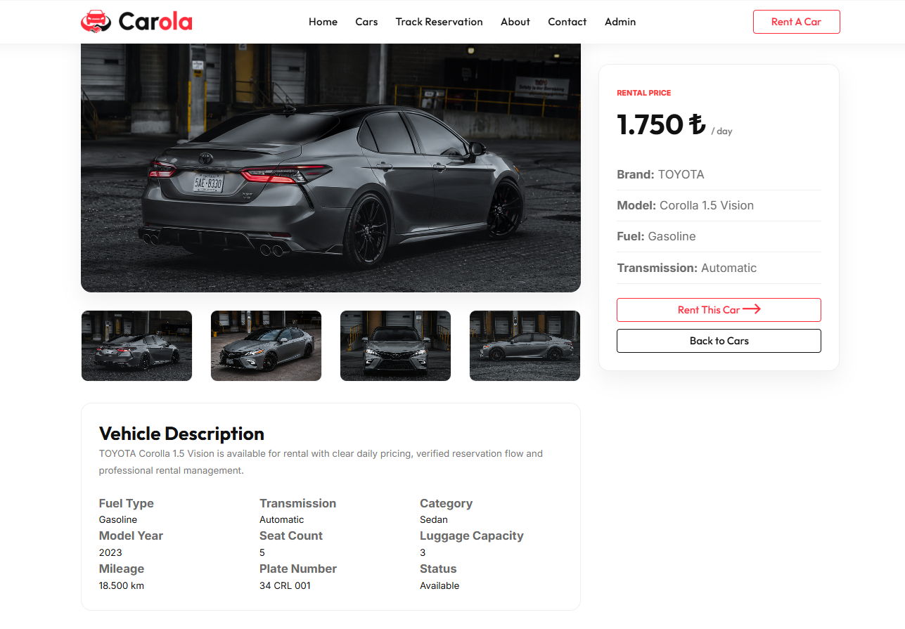

---

## Reservation Form

Customers can create a reservation request by selecting a car, entering personal information, choosing pickup and return dates, and selecting locations.

The system checks existing pending and approved reservations to prevent double booking.

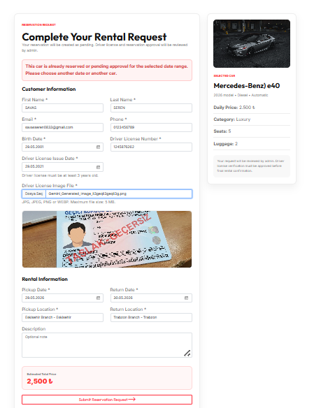

---

## Reservation Tracking

Customers can track their reservation status using their **Reservation Code** and **Email Address**.

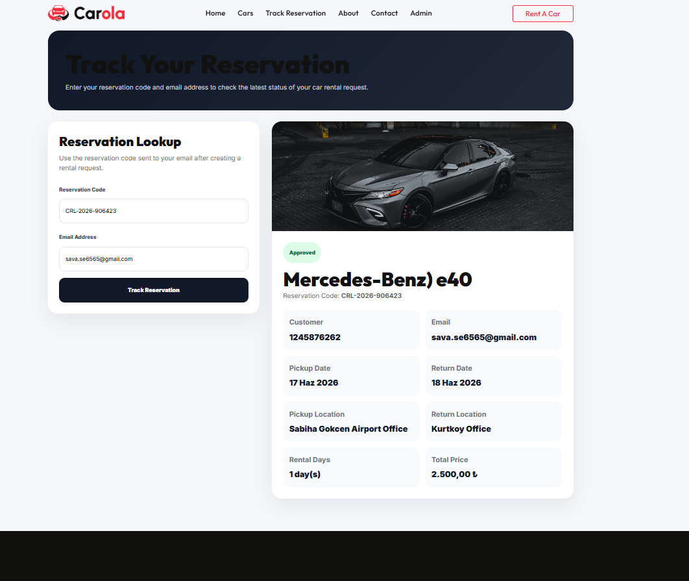

---

## Contact Form

Visitors can send messages from the public contact page. Messages are saved directly to the database and displayed in the admin contact inbox.

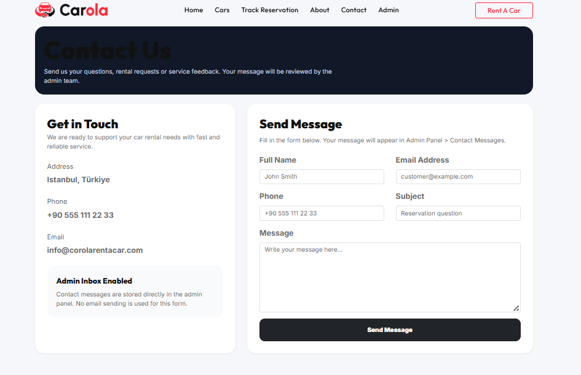

---

# Admin Panel

## Admin Login

The admin panel is protected with cookie-based authentication. Unauthorized users are redirected to the login page.

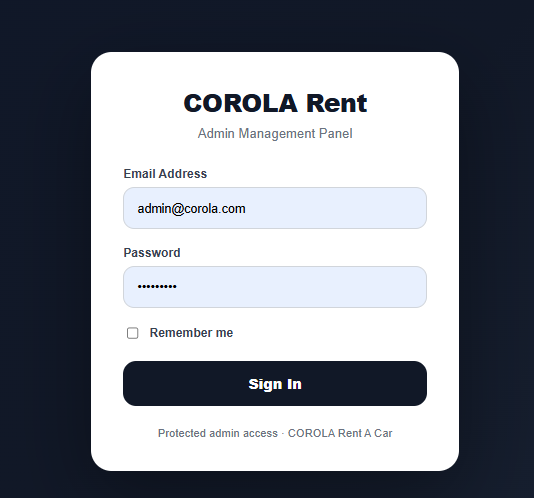

---

## Admin Dashboard

The dashboard provides a centralized management area for cars, reservations, reports, AI tools and contact messages.

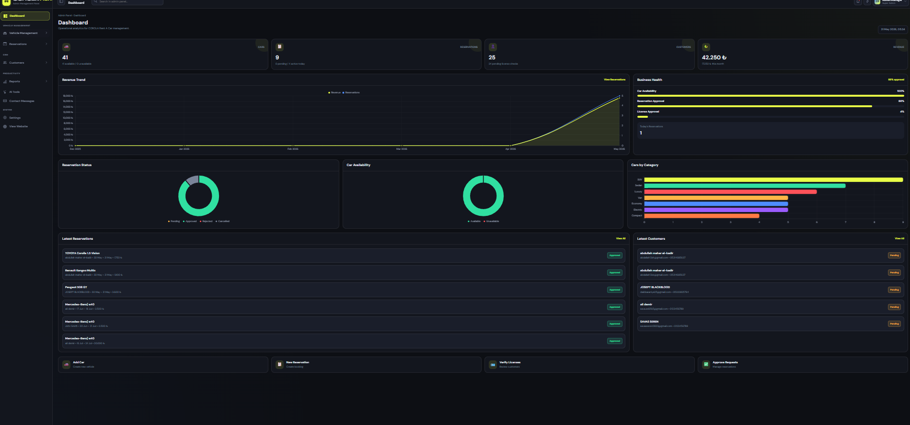

---

## Reservation Management

Admins can view, search, approve, reject, cancel and delete reservations.

Reservation statuses:

* Pending
* Approved
* Rejected
* Cancelled

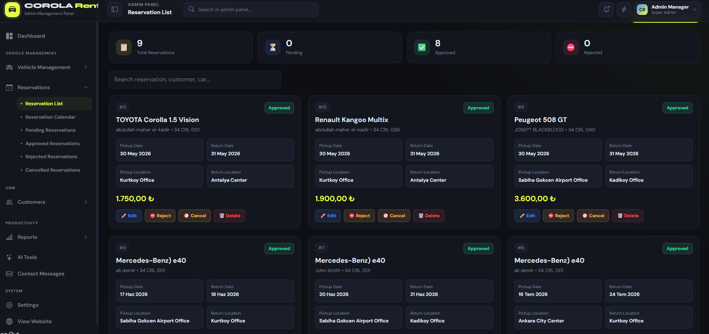

---

## Reservation Calendar

The reservation calendar gives admins a visual overview of rental dates and reservation activity.

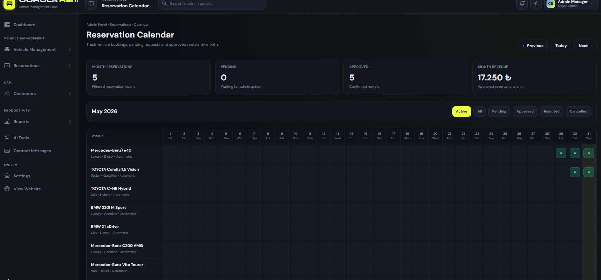

---

## Reports

The admin reporting module provides operational insights such as reservation counts, status distribution and revenue-related metrics.

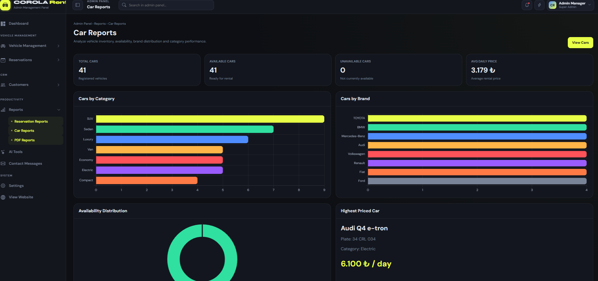

---

## PDF Reports

The project uses **QuestPDF** to generate professional PDF reports.

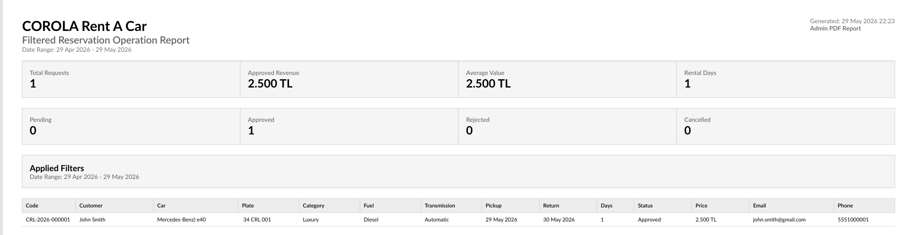

---

## MailKit Approval Email

When an admin approves a reservation, the system sends an approval email to the customer using **MailKit SMTP**.

The email includes reservation details and the reservation code.

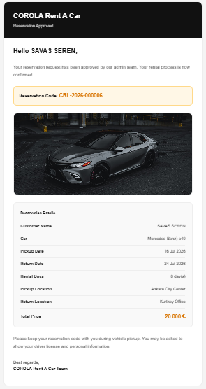

---

## AI Car Description Tool

The admin panel includes an AI-supported car description generator.

It can generate car descriptions based on brand, model, category, fuel type, transmission, seat count, daily price and features.

The system also supports mock mode, so the feature can be tested without using paid API credits.

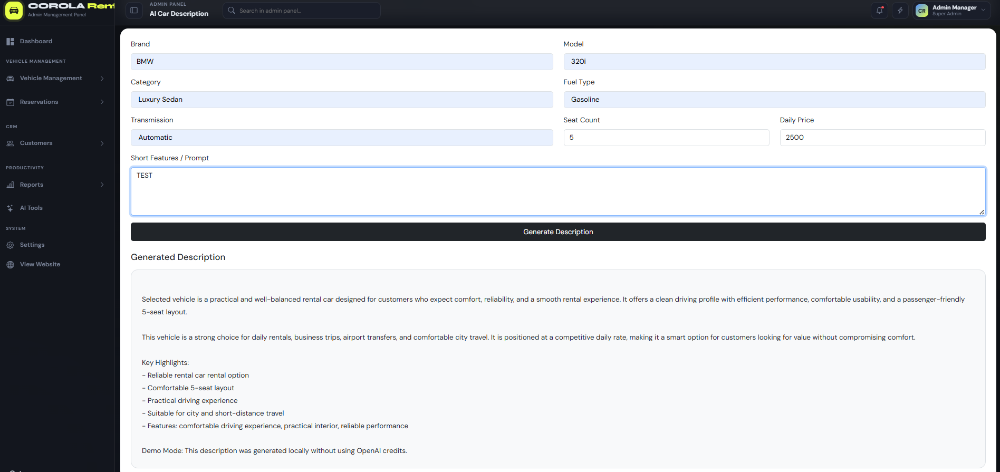

---

## Admin Contact Inbox

Messages from the public contact form are displayed inside the admin panel.

Admins can view messages, check read/unread status, open message details and delete messages.

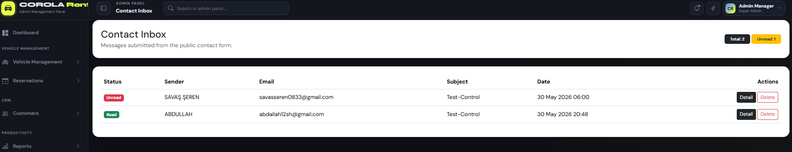

---

# Core Workflows

## Reservation Workflow

```text
Customer selects a car
        ↓
Customer creates reservation request
        ↓
System checks date availability
        ↓
Reservation is saved as Pending
        ↓
Admin approves or rejects reservation
        ↓
If approved, MailKit sends approval email
        ↓
Customer tracks reservation with Reservation Code + Email
```

## Contact Message Workflow

```text
Visitor submits contact form
        ↓
Message is saved to database
        ↓
Admin sees message in Contact Inbox
        ↓
Admin opens message detail
        ↓
Message becomes Read
```

---

# Main Entities

* Brand
* Category
* Car
* CarImage
* Customer
* Location
* Reservation
* ContactMessage

---

# Installation

## 1. Clone the repository

```bash
git clone https://github.com/SavashSheren/COROLA_RENTACAR.git
```

## 2. Open the solution

Open the solution in Visual Studio:

```text
COROLA_RENTACAR.sln
```

## 3. Configure database

Update the SQL Server connection string for your local environment.

## 4. Apply migrations

Package Manager Console:

```powershell
Update-Database
```

## 5. Configure MailKit

Example configuration:

```json
"MailSettings": {
  "SmtpHost": "smtp.gmail.com",
  "SmtpPort": 587,
  "SenderName": "COROLA Rent A Car",
  "SenderEmail": "example@gmail.com",
  "SenderPassword": "your-app-password"
}
```

For Gmail SMTP, use a Gmail App Password.

## 6. Configure AI Tools

```json
"OpenAI": {
  "ApiKey": "",
  "TextModel": "gpt-4.1-mini",
  "VisionModel": "gpt-4.1-mini",
  "EnableAiVerification": false
},
"AiTools": {
  "UseMockMode": true
}
```

## 7. Run the project

Set `COROLA_RENTACAR.WebUI` as the startup project and run the application.

---

# Admin Access

Example development account:

```text
Email: admin@corola.com
Password: configured locally
```

Do not publish real admin credentials, SMTP passwords or API keys.

---

# Security Notes

Do not commit:

* Real Gmail App Password
* Real SMTP password
* Real OpenAI API key
* Real admin password
* Production connection string

Use safe placeholder values in `appsettings.json`.

---

# Completed Modules

* Public home page
* Public about page
* Public contact form
* Public car listing
* Advanced car filtering
* Date availability filtering
* Car detail gallery
* Reservation request system
* Reservation code generation
* Reservation tracking page
* Admin login
* Admin authorization
* Admin dashboard
* Admin reservation management
* Reservation calendar
* PDF reports
* MailKit approval email
* AI car description tool
* Admin contact inbox

---

# Future Improvements

* Full demo seed script
* Customer account system
* Online payment integration
* Car maintenance tracking
* Cloud image storage
* Deployment pipeline
* Role-based admin authorization
* More advanced dashboard analytics

---

# Developer

Developed by **Savash Sheren**

GitHub: **SavashSheren**
